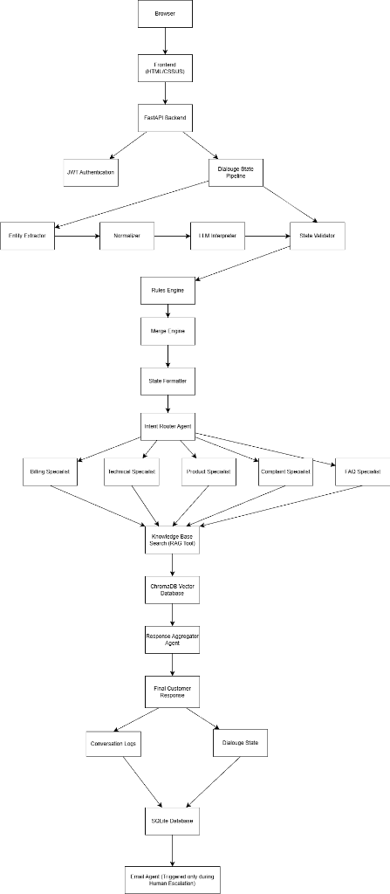

# Multi-Agent AI Customer Support Assistant

> An AI-powered customer support system built using **FastAPI, CrewAI, Ollama, ChromaDB, and Retrieval-Augmented Generation (RAG)**. The system routes customer queries to specialized AI agents, retrieves factual information from a company knowledge base, maintains conversation state, and supports automated human escalation.

---

## Overview

The **Multi-Agent AI Customer Support Assistant** is designed to simulate an intelligent customer support platform for an e-commerce electronics company (**NovaCart Electronics**).

Instead of relying on a single LLM to answer every query, the system uses multiple specialized AI agents coordinated by CrewAI. Each agent focuses on a specific support domain such as technical troubleshooting, billing, products, complaints, or general FAQs.

The assistant retrieves verified information from an internal knowledge base using Retrieval-Augmented Generation (RAG), ensuring responses are grounded in company documentation rather than model memory.

The project demonstrates how multiple AI agents, local LLMs, dialogue state management, and vector databases can work together to build an intelligent customer support workflow.

---

# Features

### Multi-Agent Architecture

* Intent Router Agent
* FAQ Specialist
* Product Specialist
* Billing Specialist
* Technical Specialist
* Complaint Specialist
* Response Aggregator

---

### Retrieval-Augmented Generation (RAG)

* Local ChromaDB vector database
* Semantic document chunking
* SentenceTransformer embeddings
* Company knowledge base built from PDF documents
* Context-aware retrieval for grounded responses

---

### Dialogue State Management

* Conversation-specific dialogue state
* Session isolation using conversation IDs
* Active and resolved issue tracking
* Product context tracking
* Follow-up question understanding

---

### Human Escalation

* Detects unresolved customer issues
* Offers escalation to human support
* Automatically emails issue summaries
* Sends confirmation email to customers

---

### Authentication

* JWT Authentication
* User registration
* User login
* Protected API endpoints

---

### Analytics & Feedback

* Conversation logging
* Customer feedback collection
* Admin dashboard
* Interaction history

---

### Knowledge Base

The assistant answers questions using company documentation including:

* FAQ
* Product Catalog
* Pricing
* Shipping Policy
* Refund Policy
* Warranty Policy
* Installation Guide
* User Manual

---

### Conversation-Aware Dialogue State

Maintains isolated conversation state using unique conversation IDs, enabling follow-up question understanding while preventing state leakage across browser sessions.

---

# Tech Stack

## Backend

* FastAPI
* Python
* SQLAlchemy
* SQLite
* JWT Authentication

## Framework & LLMs

* CrewAI Framework
* Ollama
* Gemma 3:4b
* Llama 3.2:3b
* Qwen 2.5:3b
* Qwen 2.5:7b

## Retrieval

* ChromaDB
* LangChain
* SentenceTransformers
* all-MiniLM-L6-v2 Embeddings

## Frontend

* HTML
* CSS
* JavaScript

---

# System Architecture



---

# Project Structure

```
Multi-Agent-AI-Customer-Support-Assistant
│
├── backend
│   ├── app
│   │   ├── agents              # CrewAI agent definitions
│   │   ├── api                 # API package
│   │   ├── auth                # Authentication & JWT
│   │   ├── config              # LLM configuration
│   │   ├── crews               # Crew orchestration
│   │   ├── database            # Database session
│   │   ├── dependencies        # FastAPI dependencies
│   │   ├── memory              # Chat memory utilities
│   │   ├── models              # SQLAlchemy models
│   │   ├── rag                 # RAG pipeline
│   │   ├── router              # API routes
│   │   ├── schemas             # Request/Response schemas
│   │   ├── services            # Business services
│   │   ├── state               # Dialogue state engine
│   │   ├── tasks               # CrewAI tasks
│   │   ├── tools               # Custom CrewAI tools
│   │   ├── utils               # Utility functions
│   │   └── main.py
│   │
│   ├── chroma_db               # Vector database
│   ├── knowledge_base          # PDF knowledge base
│   ├── logs                    # Conversation logs
│   ├── tests
│   ├── customer_support.db
│   ├── requirements.txt
│   └── .env.example
│
├── docs
│
├── frontend
│   ├── index.html
│   ├── admin.html
│   ├── admin.css
│   └── admin.js
│
├── LICENSE
├── README.md
└── project_report.md
```

---

# Installation

## Clone Repository

```bash
git clone <repository-url>

cd Multi-Agent-AI-Customer-Support-Assistant
```

---

## Create Virtual Environment

```bash
python -m venv venv
```

Windows

```bash
venv\Scripts\activate
```

Linux / macOS

```bash
source venv/bin/activate
```

---

## Install Dependencies

```bash
pip install -r backend/requirements.txt
```

---


## Install Ollama

* Download and install Ollama from:

https://ollama.com/download

* Pull the Required Models

```bash
ollama pull gemma3:4b

ollama pull llama3.2:3b

ollama pull qwen2.5:3b

ollama pull qwen2.5:7b
```

* Start Ollama

```bash
ollama serve
```

## Configure Environment

Create a `.env` file inside the backend directory.

Example:

```env
SECRET_KEY=your_secret_key

EMAIL=admin_email@gmail.com

EMAIL_APP_PASSWORD=your_google_app_password
```

EMAIL → Administrator email address used to receive escalated customer issues.
EMAIL_APP_PASSWORD → Google App Password associated with the email account which the ai will use to send emails when needed.

---

## Start the Application
```bash
cd backend

uvicorn app.main:app --reload

Once the server starts, open:

http://127.0.0.1:8000
```
---

# Example Workflow

Customer

↓

Frontend

↓

FastAPI Backend

↓

Dialogue State Pipeline

↓

Intent Router Agent

↓

Relevant Specialist Agent

↓

Knowledge Base Search (RAG)

↓

ChromaDB retrieves relevant document chunks

↓

Specialist extracts verified findings

↓

Response Aggregator

↓

Customer receives grounded response

↓

Dialogue State + Conversation Logs updated

↓

(SQLite)

↓

If required → Human Escalation Email

---

# Current Limitations

* The project uses locally hosted LLMs in the 3B–7B parameter range to ensure it can run efficiently on consumer hardware. Compared to larger proprietary models, these models may occasionally generate less accurate responses or require stricter prompt engineering.

* The human escalation email includes an automatically generated issue summary derived from the Dialogue State. Since the 'active_issues' list is maintained through an append-based update strategy driven by LLM event extraction, the generated summary may occasionally include redundant or less relevant issue descriptions. This does not affect the customer-facing chat responses but may reduce the precision of escalation summaries.

* Product entity extraction currently relies on rule-based matching for the fictional NovaCart product catalog and is not yet dynamically generated from the knowledge base.

* Knowledge base updates require re-ingesting PDF documents into ChromaDB rather than automatic synchronization.
---

# Future Enhancements

* Dynamic product and entity extraction from the knowledge base
* Hybrid search (semantic + keyword retrieval)
* Automatic knowledge base synchronization
* Conversation history interface
* Streaming LLM responses
* Docker deployment
* PostgreSQL support
* Redis caching
* Monitoring dashboard
* Multi-company knowledge base support

---

# License

This project is licensed under the **MIT License**.

